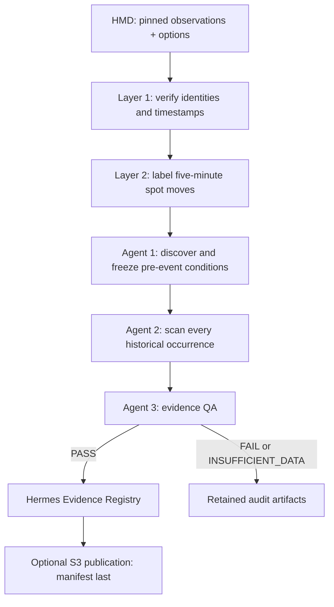

# Hermes Evidence Engine — LangGraph

Implements the notebook's historical market data (HMD) workflow as a sequential
LangGraph `StateGraph`. It consumes the existing cleaner's verified local table
snapshots and produces reproducible event, condition, occurrence, and QA evidence.



Every node writes immutable artifacts; checkpoints contain paths, hashes, and
small run metadata. SQLite checkpoints survive process restarts. Discovery,
scanning, and QA run in sequence. Agent 3 reports findings and cannot revise
Agent 1's frozen rules.

This implementation uses deterministic, interpretable hypothesis search.
The three agents are graph stages; they do not invoke an LLM. An LLM proposer can
later be added behind the same restricted rule contract. Numeric calculations,
source eligibility, matching, and QA remain deterministic.

See [the first verified historical run](VERIFICATION.md) for source coverage,
test results, discovered conditions, evaluation outcomes, and S3 evidence.
See [the latest joint momentum run](../evidence_dashboard/VERIFICATION_2026-09-28.md)
for automatic source refresh, frozen combined hypotheses and September 23–24
evaluation coverage.

## Run

From `/Users/viswatej/Desktop/openalgo`:

```bash
uv venv evidence_engine/.venv --python python3.13
uv pip install --python evidence_engine/.venv/bin/python -r evidence_engine/requirements.lock

# Local research from existing, completed cleaned snapshots.
evidence_engine/.venv/bin/python -m evidence_engine --run-id research-001

# Resume an interrupted run using its saved inputs/configuration.
evidence_engine/.venv/bin/python -m evidence_engine --run-id research-001 --resume

# Explicit source selection and chronological discovery cutoff.
evidence_engine/.venv/bin/python -m evidence_engine \
  --source-registry data_cleaning_agent/runtime/enrichment_verification_2026-09-19.json \
  --discovery-end 2026-09-15

# Tests use synthetic records and fake AWS clients.
evidence_engine/.venv/bin/python -m pytest -q evidence_engine/tests
```

The CLI's default source registry is the existing September 19 enrichment verification
registry. A later CLI dataset requires an explicit updated registry. The
[evidence dashboard](../evidence_dashboard/README.md) automatically discovers
completed daily exports and supplies an immutable verified source snapshot for
each new run. The engine
rechecks the exact local Parquet bytes against its hashes and sizes. It does not
claim to refresh the prior remote S3 verification or collect new observations.
The registry has `status: VERIFIED` and `verified` entries containing `run_dir`,
`rows_per_table`, and SHA-256/size metadata for both Parquet tables. Relative
`run_dir` paths are resolved before snapshotting the registry.

Inputs are the cleaned exports produced from PostgreSQL by
[`data_cleaning_agent`](../data_cleaning_agent/README.md). This engine does not
rebuild the cleaner or change raw PostgreSQL data. Historical research can run
on weekends because it reads already captured observations.

Exit code `0` means the run entered the integrity-checked evidence registry.
Code `2` means QA failed or found insufficient data; inspect
`agent3/qa_report.json`. Input validation and execution failures raise an error;
completed nodes remain checkpointed. Resume rejects changed source snapshots,
recorded artifacts, configuration, or engine source code. Start a new run after
changing the engine. Preserve `output/checkpoints.sqlite3` for recovery.

## Event and timing definition

The default instrument is the NIFTY spot series in the supplied dataset. This
version samples NIFTY and records counts of other underlying symbols it excludes,
keeping the point threshold specific to one instrument. Missing, nonfinite,
nonpositive, or nonnumeric source spot values fail input validation.

- One-minute clock anchors, with a five-minute forward horizon.
- `point_change = spot_at_end - spot_at_start`.
- `UP_MOMENTUM`: `point_change >= 50`.
- `DOWN_MOMENTUM`: `point_change <= -50`.
- Moves above 80 points are included. Smaller complete moves are `OTHER`.
- Missing, stale, discontinuous, or out-of-session horizons remain `UNKNOWN`.
  They never count as negative outcomes.

These labels describe the change at the five-minute endpoint. They do not label
the first time a price touches 50 points and subsequently reverses.
The version is `spot-endpoint-momentum-v2`. Saved legacy runs retain their
`spot-endpoint-band-v1` labels and inclusive 50–80-point target band.

Storage uses timezone-aware UTC timestamps; sessions use Asia/Kolkata,
09:15 inclusive to 15:30 exclusive. Endpoints use the last observation at or
before the clock boundary, at most five seconds old. Actual receipt-to-receipt
duration can therefore be 295–305 seconds and is retained. A gap above ten
seconds invalidates a forward window. This is an explicitly bounded observation
of a clock horizon, not an exact exchange-time measurement.

`condition_at` is one nanosecond before the actual start receipt. It is a strict
research cutoff, not a claim of nanosecond provider resolution. Features must
already have been available by that cutoff. Previous/current raw quotes have a
five-second age limit. IV and Greeks use their own availability timestamps,
with a ten-second calculation age and fifteen-second source quote age limit.
Unknown provider timestamps stay unverified.

The two source tables join one-to-one on `observation_id`. Call and put rows
sharing a spot receipt produce one underlying observation. Conflicting spot
values fail validation. Option features stay within a continuous contract
segment; an ATM strike switch does not splice two contracts together. Legacy
rows without version-2 receipt provenance are counted and excluded.

## The three agents

**Agent 1** discovers joint CE/PE/IV conditions. Every candidate is an **AND**
of four predicates: CE and PE observations from the same feature family
(midpoint returns, OI changes or volume increments), plus CE IV and PE IV.
The bounded search considers discovery-session quantiles for the paired
observations and median regimes for both IV values. Thresholds use complete
discovery observations only; no evaluation labels enter selection. Candidates
must have at least five matches, at least one target event, and an in-sample
event rate above the baseline where all four features are available. It freezes
at most six combinations, ordered by discovery lift, successes, support, then
stable identity. Every tested combination is recorded. Missing either side or
either IV makes the combination unavailable. Explicit legacy configurations
still support single-feature research for reproducibility.
The thresholds, source references, matching discovery-event timestamps, run
execution date, and rule hashes are retained. OI and volume changes are measured
within a contract; decreasing volume counters produce a missing increment.

**Agent 2** scans every sampled historical anchor using the frozen rules. It
retains each match, including failures and unknown outcomes, and counts
non-matches and unavailable features. It reports discovery and evaluation
separately, together with each jointly feature-eligible baseline. Occurrences
retain every predicate's numeric value in `feature_values_json` and its source
lineage, rather than assigning a single value to a combination. The default split
uses the first 60% of whole sessions for discovery and the remaining sessions
for evaluation. Same-session horizons and whole-session separation prevent
training outcome windows from reaching into evaluation. The split can be fixed
with `--discovery-end`.

One-minute anchor counts contain overlapping outcomes. Separate conservatively
spaced counts use at least horizon plus maximum quote age between anchors,
chosen without inspecting the outcome. These counts can still have dependence
within and between sessions; they are not significance tests.

**Agent 3** checks hashes, source identity and availability, event arithmetic,
feature lineage, chronological partitions, frozen conditions, exhaustive
occurrences, and denominator reconciliation. It uses source reconstruction and
replay checks; replay verifies consistency with the implemented sampler and is
not a second independent market-data provider. A failed check blocks registry
publication. No selected conditions, no evaluation sessions, or no known
evaluation match produces `INSUFFICIENT_DATA`.

An integrity `PASS` is recorded as `EXPLORATORY` evidence. Candidate search,
limited history, repeated testing, contract selection, provider timing, and
stored Greek model assumptions constrain interpretation. This workflow does
not establish predictive usefulness, causality, or permission to trade.

## Artifacts and S3

```text
evidence_engine/output/
  checkpoints.sqlite3
  registry/<run_id>.json
  runs/<run_id>/
    request.json                 # execution time, frozen config, engine code hashes
    source_registry.json         # pinned source selection
    dataset.json                 # input hashes, dates, exclusions, timing provenance
    aligned.parquet              # joined source rows; original files unchanged
    alignment.json               # timing rules, coverage, exclusions
    samples.parquet              # all eligible anchors and unknown outcomes
    events.parquet               # qualifying UP/DOWN events
    agent1/conditions.json       # rules, all trial results, discovery timestamps
    agent2/occurrences.parquet   # every match, outcome and source lineage
    agent2/statistics.json
    agent3/qa_report.json
    registry.json               # present only for integrity PASS
    quarantine.json             # present for failed/insufficient evidence
    manifest.json               # final status and all artifact hashes
```

S3 publication is explicit and uses the standard AWS credential chain:

```bash
evidence_engine/.venv/bin/python -m evidence_engine \
  --run-id research-001 --resume --s3-bucket YOUR_EVIDENCE_BUCKET
```

The prefix is
`evidence-engine/execution_date=YYYY-MM-DD/run_id=<run_id>/`, with UTC execution
date kept separate from market-data dates. Objects use AES256 encryption,
conditional creation, SHA-256 metadata, and exact-byte verification when a
retry encounters an existing object. The final `manifest.json` is uploaded
last. Consumers accept only complete manifests whose dependencies verify.
The bucket must already exist. Local execution does not contact AWS or an LLM.

LangGraph references: [graph API](https://docs.langchain.com/oss/python/langgraph/graph-api),
[persistent checkpoints](https://docs.langchain.com/oss/python/langgraph/persistence).
