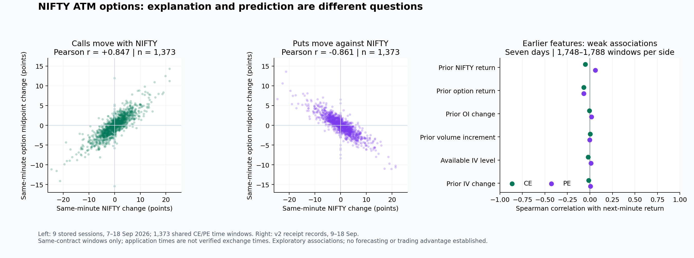

# Cleaned S3 data and feature relationships

## What is stored after cleaning

PostgreSQL is the operational database. The cleaner reads its raw option snapshots, market snapshots, stored option calculations and ingestion receipts. It exports linked, typed table snapshots to S3. S3 holds files; this export does not itself create a SQL query service. [Athena](https://docs.aws.amazon.com/athena/latest/ug/what-is.html) is an optional service for querying S3 files with SQL.

```text
s3://heremesv0-cleaned-data/cleaned/YYYY-MM-DD/
  commits/<revision>.json
  <run-uuid>/
    observations.parquet
    options.parquet
    observations.csv
    options.csv
    quality_report.json
    manifest.json
```

| File | Role |
|---|---|
| `observations.parquet` | Observation time, NIFTY spot, option-contract volume, IV, source provenance and IV availability time |
| `options.parquet` | Contract identity, strike, call/put, expiry, OI, last trade, bid/ask, Greeks, calculation inputs and availability time |
| CSV copies | Human-readable copies of the same two tables; not additional observations |
| `quality_report.json` | Integrity checks, missing features, quarantine and collection coverage |
| `manifest.json` | Schema, source evidence, counts, provenance and artifact checksums |
| Commit record | Pins a successfully published revision and its manifest |

Join the tables **one-to-one on `observation_id`**. A timestamp or raw receipt ID can be shared by a call and a put, so neither is a safe join key. Use `contract_key` to track a contract over time; do not deduplicate all observations of a contract into one row.

The verified export contains **61,056 rows in each table**, giving **61,056 joined option observations**, across nine collected sessions: September 7, 8, 9, 10, 11, 15, 16, 17 and 18, 2026. These are rolling ATM calls and puts, not a complete option chain. There are **60,153 rows with IV and all four main Greeks**, and **903 without usable stored calculations**. Complete IV/Greeks coverage is approximately **98.52%**. Other optional fields can still be missing.

For each date, select one intended verified commit and follow its manifest. There is no `latest` pointer. Old revisions remain in S3, so reading every run would duplicate records. The selection used here is pinned in [the verification registry](../../../data_cleaning_agent/runtime/enrichment_verification_2026-09-19.json). S3 byte hashes were verified at **2026-09-19 09:20:47 IST**. This research rechecked the matching 18 local Parquet hashes and sizes; it did not repeat a live S3 download.

A cleaning **PASS** means the integrity checks passed. It does not mean complete feature coverage, a gap-free session, verified exchange timestamps or accurate model assumptions.

## How I use the features

My primary outcome is the **percentage change in an option's bid/ask midpoint over the next minute**. Midpoint is `(bid + ask) / 2`; it describes the quote and is not a guaranteed execution price.

| Feature group | Transformation or relationship to investigate |
|---|---|
| Timestamp and expiry | Order observations; derive time of day and days remaining. Unix timestamps are storage representations, not useful direct price predictors. |
| Spot and strike | Spot return and moneyness, `100 × (spot / strike − 1)`. Compare the same contract over time. |
| IV | Store as decimal: `0.1055 = 10.55%`. Measure IV changes in percentage points and distinguish estimated IV from raw market fields. |
| Delta | Sensitivity to the calculation underlying; call and put directions differ. |
| Gamma | Change in delta as the calculation underlying moves; useful for examining nonlinear response. |
| Vega | Price sensitivity to a one-percentage-point IV move in this stored implementation. |
| Theta | Time sensitivity per calendar day in this implementation; inspect alongside time remaining. |
| OI | Changes in outstanding positions and their interaction with price/IV; OI alone does not identify buying pressure or direction. |
| Volume | Difference in the provider's total-volume counter within the same day and contract; retain source units and handle counter resets. Never sum snapshot counters. |
| Bid and ask | Midpoint, spread and spread as a percentage of midpoint; useful for liquidity and trading-cost assessment. |
| Provenance and availability | Determine which values could have been known at each decision time. |

Greeks describe price sensitivities and interact with underlying moves, volatility and elapsed time. They are model outputs rather than independent market measurements. See [CME's explanation of option premium and Greeks](https://www.cmegroup.com/education/courses/option-greeks/options-the-greeks-options-premium-and-the-greeks).

For a local sensitivity explanation, a Taylor approximation is:

```text
premium change ≈ delta × calculation-underlying change
               + 0.5 × gamma × calculation-underlying change²
               + vega × IV change in percentage points
               + theta × elapsed calendar days
```

This is a local approximation, not a forecast or an exact attribution. Interest-rate effects, changing sensitivities and other terms are omitted. Stored values use **OPENALGO_BLACK76**, with a zero-rate assumption and an unverified spot/forward basis. Black-76 delta and gamma must not automatically be applied to raw NIFTY spot as though their input were verified spot.

### Concrete timing example from your original row

For `NIFTY22SEP2623350CE`, the raw observation arrived on September 18 at **09:15:05.902530 IST**; expiry is September 22 at **15:30 IST**. Its restored IV is **10.55%**, delta **0.5219**, gamma **0.001496**, theta **−12.4511/day**, and vega **10.0545 per IV percentage point**.

Those calculations arrived at **09:15:07.647454 IST**, about **1.745 seconds later**. Historical features must respect that later availability. The raw spot was **23,344.95**, while the stored calculation used **23,363.10** as its underlying input, further illustrating why its Greek attribution cannot silently use raw spot. Provider event time remains unknown.

## What the actual data shows

### 1. Simultaneous price movement

Across nine sessions, the independent analysis selected **1,373 nonoverlapping, approximately one-minute intervals per side**. Both sides share the same 1,373 NIFTY time windows.

| Relationship | Pearson correlation | Spearman correlation |
|---|---:|---:|
| NIFTY point change vs call midpoint point change | +0.8467 | +0.8416 |
| NIFTY point change vs put midpoint point change | −0.8607 | −0.8455 |

Calls generally moved with NIFTY and puts against it. This establishes descriptive co-movement, not causality or forecasting ability. Excluding the legacy September 7–8 sessions gives Pearson correlations **+0.8680 / −0.8693**, with 1,264 intervals per side.

Method: last quote at or before each minute boundary, no more than five seconds old; start quote 60–65 seconds earlier; same contract throughout; split at receipt gaps above ten seconds or contract changes; reject overlapping intervals. This selection describes uninterrupted ATM-contract windows and excludes transitions.

### 2. Earlier features versus the following minute

The separate lagged exercise uses the **seven v2 sessions**, September 9–18, with **1,788 windows per side**. Legacy timing was excluded. Each feature uses information available at the current raw receipt; the outcome is a later midpoint return. The table shows Spearman rank correlations, which describe monotonic association and reduce sensitivity to extreme magnitudes.

| Earlier feature | Call next-minute return | Put next-minute return | Windows per side |
|---|---:|---:|---:|
| Prior NIFTY return | −0.0526 | +0.0601 | 1,788 |
| Prior option midpoint return | −0.0700 | −0.0682 | 1,788 |
| Prior OI percentage change | −0.0048 | +0.0173 | 1,788 |
| Prior volume increment | +0.0042 | −0.0020 | 1,788 |
| Available IV level | −0.0191 | +0.0126 | 1,770 |
| Prior IV change | −0.0136 | +0.0049 | 1,748 |

These pooled associations are weak. Daily results vary, often changing sign. They do not establish a useful trading signal, and weak simple correlation does not rule out nonlinear or conditional relationships. The saved CSV includes all 13 tested features, both correlation measures and every session separately; the table above selects common feature groups, not the best-scoring features.

Method: use minute-clock past/current/future endpoints with quotes no older than five seconds; all must belong to one continuous contract segment. Future intervals last 55–65 seconds and do not overlap within day and side. For IV/Greeks, select the latest same-segment calculation received by the raw quote time, with calculation receipt age at most ten seconds and source quote age at most fifteen seconds. Select past IV independently at the past endpoint. Preserve missing values and show each feature's actual sample count.



## How I would advance the analysis

1. **Freeze the dataset and target.** Pin verified daily commits. Start with one-minute midpoint returns and a separate five-minute horizon. Retain receipt gaps, missingness and contract-switch records for audit.
2. **Build information available at each time.** Join by observation ID, group by contract and day, transform levels into returns/changes where appropriate, and use calculation availability timestamps. Never carry an old strike's prices into a new ATM strike.
3. **Explain price behaviour.** Examine spot movement, IV, time remaining, moneyness, spreads, OI and volume changes separately for calls and puts. Test interactions such as spot move × moneyness and IV change × vega, with model-basis qualifications.
4. **Test forecasting incrementally.** Start with a no-change baseline and a small regularized model. Add activity, volatility and sensitivity groups one at a time. Measure whether each group helps on later sessions, rather than ranking features solely by an in-sample correlation matrix.
5. **Validate chronologically.** Train only on earlier sessions, evaluate on later sessions, and keep a final set of newly collected sessions untouched. Exclude training labels whose outcome windows overlap validation periods. Fit scaling and missing-value treatment using training data only. Use day/block-based uncertainty rather than treating every high-frequency row as independent.
6. **Assess practical value.** Check stability across days, expiry distance and contract transitions. For a trading test, use appropriate bid/ask execution assumptions, fees, slippage and timing constraints. Compare a strategy with its baseline after costs.

The nine existing sessions are an exploratory sample. No forecasting model, holdout performance or net trading return has been validated here.

### Interpretation limits that matter

- Application receipts do not verify exchange event freshness, simultaneous provider inputs, database persistence time or executable fills.
- Calls and puts share underlying observations; adjacent windows also remain dependent.
- Requiring a future quote in the same contract segment conditions inclusion on future availability. It is a filter for this descriptive analysis, not a live trading eligibility rule.
- Features normalized by the current midpoint share a denominator with future returns; some association may be mechanical. Pooled feature levels can also reflect differences between sessions.
- Many features were inspected in a small dataset; no significance or causal claims are made. ATM-only observations cannot establish full-chain skew, term structure or other-strike behaviour.
- A future model must account for missing calculations and transitions explicitly; dropping them does not show that a strategy could have known which intervals would remain usable.

## Reproduce and inspect

Run from the workspace root using an environment with pandas, NumPy, PyArrow and Matplotlib:

```sh
python3 para-data/research/2026-09-19/qa/independent_midpoint_relationships.py
python3 para-data/research/2026-09-19/analyze_lagged_features.py
python3 para-data/research/2026-09-19/plot_relationships.py
```

- [Independent simultaneous-movement report](qa/independent_relationship_report.json)
- [Independent daily correlations](qa/independent_correlations.csv)
- [Exact simultaneous-movement samples](qa/independent_one_minute_samples.csv)
- [Lagged analysis method and limitations](lagged_relationship_report.json)
- [All lagged feature correlations, by day and pooled](lagged_feature_correlations.csv)
- [Exact lagged samples with calculation availability](lagged_one_minute_samples.csv)
- [Chart as PDF](feature_relationships.pdf)
- [Research validation summary](validation_summary.json): all 18 Parquet hashes matched; source quote identities, timing, target returns and calculation availability checked; all 208 daily/pooled correlation rows recomputed independently with SciPy.

These research artifacts are local. They do not modify the verified cleaned exports or publish a research layer to S3.
